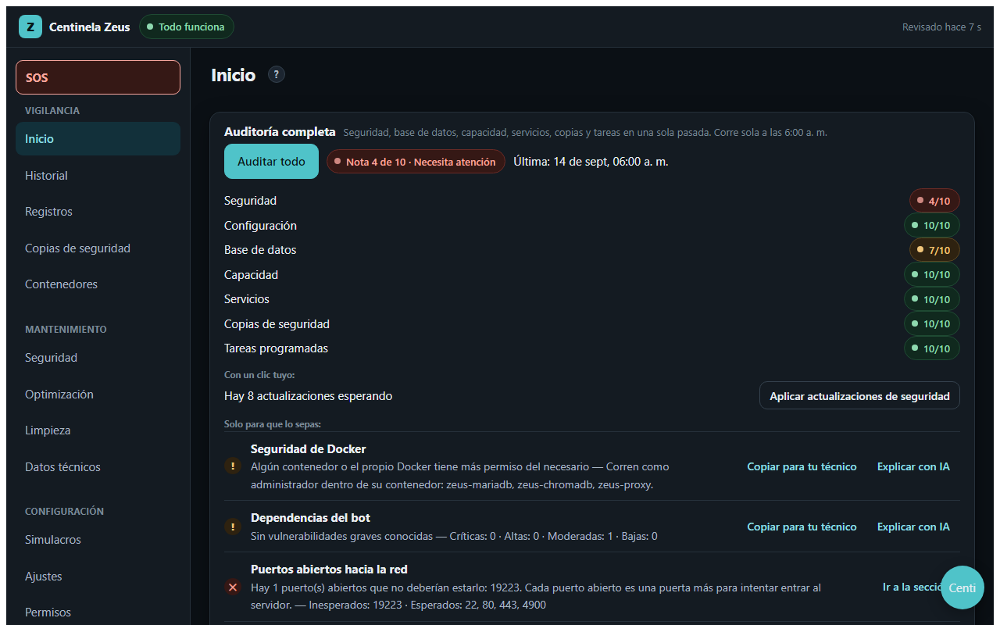
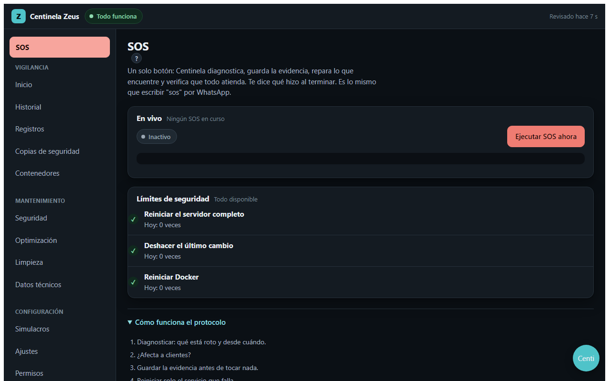
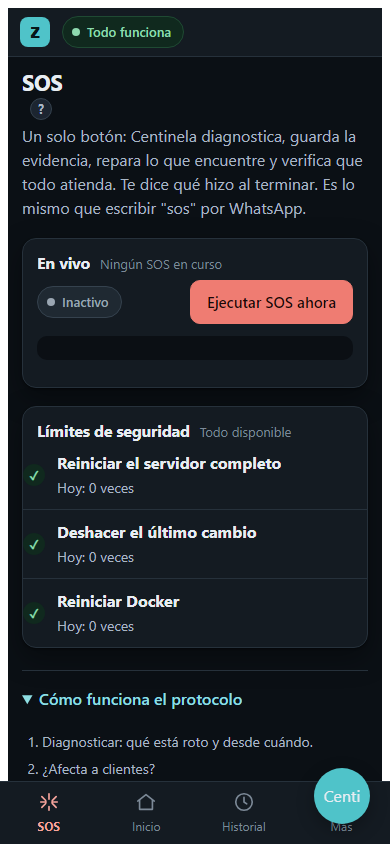
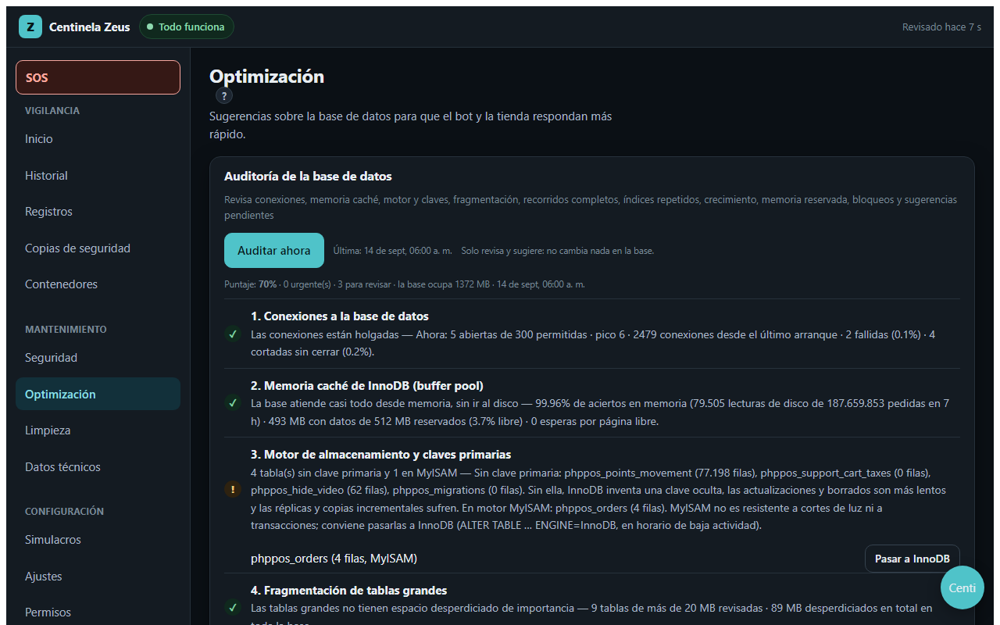
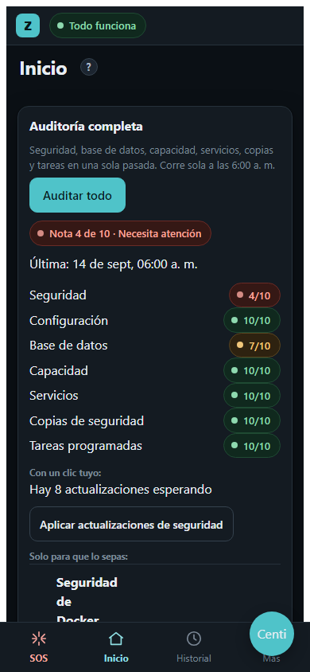
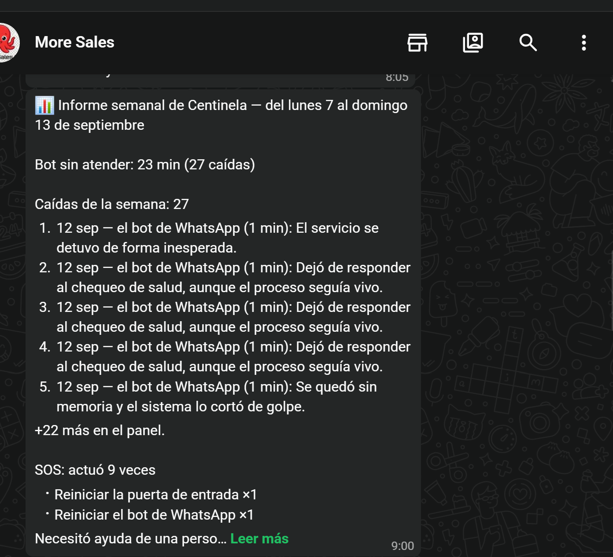
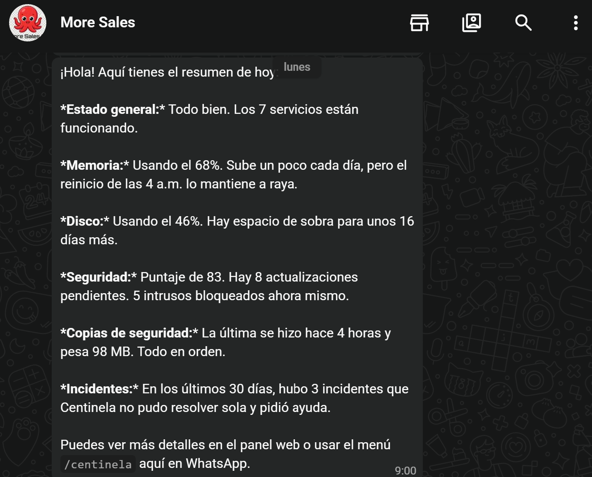
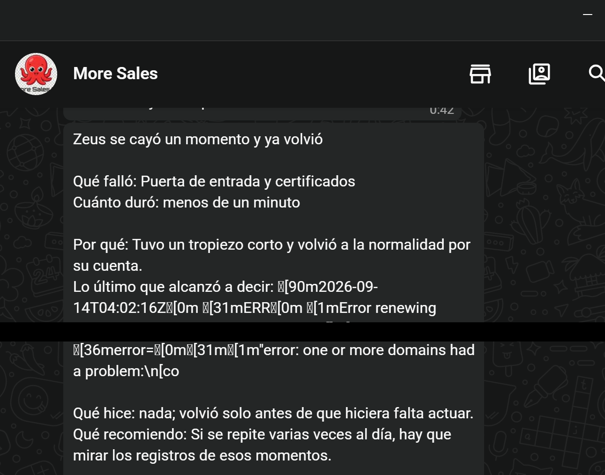
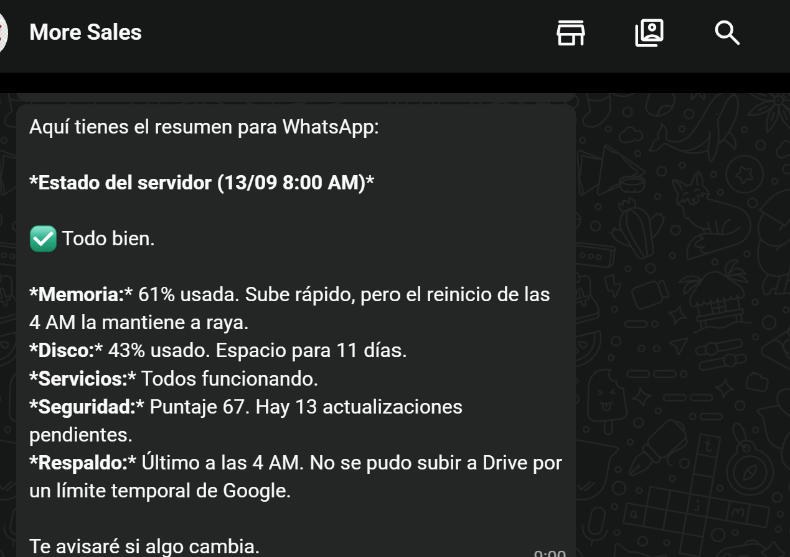
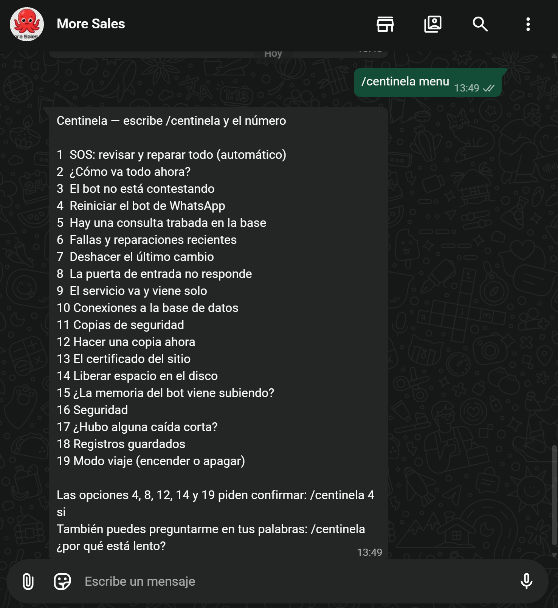

# Centinela Zeus — un ingeniero de servidores senior, en software libre, para negocios pequeños

[](CHANGELOG.md) [](LICENSE) [](package.json) [](package.json) [](modulos/pruebas)

> **¿Para qué sirve esto, en una frase?** Centinela Zeus es una herramienta de **monitoreo autónomo de servidores para bots de WhatsApp y otras apps en Docker**, con **auto-reparación de contenedores siguiendo un protocolo de incidentes y reglas de seguridad explícitas** (presupuesto de acciones, enfriamiento, autobloqueo). Es una **alternativa gratuita y de código abierto (MIT) a los servicios de monitoreo de pago** para quien administra un solo VPS Linux pequeño y no puede pagar guardia de un ingeniero 24/7. Si buscas "cómo monitorear un bot de WhatsApp en un VPS", "auto-reparación de Docker sin pagar un SRE" o "qué hacer cuando se cae mi servidor y no sé Linux", este proyecto responde exactamente a eso.

**Centinela Zeus vigila, diagnostica, repara y explica un servidor Linux con Docker — por WhatsApp y con un panel web — para un dueño de negocio que no sabe Linux.** Hace lo que haría un ingeniero de servidores con experiencia: diagnostica antes de tocar, guarda evidencia antes de reparar, repara de lo menos invasivo a lo más invasivo, verifica después de cada paso, y cuando no sabe, se detiene y lo dice.

Está pensado para **pymes, emprendimientos y proyectos con un solo VPS** que no pueden pagar a alguien dedicado a cuidarlo. Es **código abierto (MIT)** y corre hoy en producción, 24/7, cuidando el servidor de un negocio real. Cualquiera puede usarlo, adaptarlo y mejorarlo.

> *Centinela Zeus is an open-source (MIT), self-healing server operations agent for small businesses: it monitors, diagnoses, repairs and explains a Linux VPS with Docker via WhatsApp and a web panel, in plain Spanish, following a strict 9-step incident protocol. Zero dependencies, Node.js 20, plus a free Cloudflare Worker as external watchdog. See the English summary at the end.*

<p align="center"></p>

## ¿Qué problema resuelve?

Un negocio pequeño pone su bot de WhatsApp, su tienda o su API en un VPS y **nadie lo mira**. Un día el disco se llena, la base de datos se traba o un contenedor se cae a las 3 de la mañana, y el dueño se entera porque los clientes dejan de recibir respuesta. Contratar a alguien para vigilar un solo servidor no tiene sentido económico; los servicios de monitoreo avisan pero no arreglan, y hablan en un idioma que el dueño no entiende.

Centinela ocupa ese lugar:

- **Detecta** caídas, disco y memoria llenos, consultas lentas, copias de seguridad que fallan en silencio, puertos abiertos que no deberían, actualizaciones pendientes, tendencias que van a ser un problema en dos semanas.
- **Repara solo lo que es seguro reparar solo** (liberar espacio, reiniciar el servicio que falla, en orden de dependencia) y **pide una palabra escrita** para todo lo que no se puede deshacer con un clic.
- **Explica en español claro**, sin jerga: qué significa cada hallazgo, qué tan grave es de verdad, y qué botón lo arregla. Si no hay botón, dice por qué.
- **Avisa aunque el servidor esté muerto**, gracias a un vigilante externo gratuito en Cloudflare.

## Qué incluye

| Área | Qué hace |
|---|---|
| **SOS** | Protocolo de emergencia de 9 pasos, autónomo con frenos: diagnóstico determinista, evidencia enmascarada antes de tocar nada, reparación escalonada, límites diarios, enfriamiento y autobloqueo. Se lanza desde el panel o escribiendo `sos` por WhatsApp. |
| **Panel web** | 13 secciones: Inicio (Auditoría 360 con nota de 1 a 10 por área), SOS, Historial, Registros (evidencia), Copias de seguridad, Contenedores (consola en vivo), Seguridad, Optimización de base de datos, Limpieza, Datos técnicos, Simulacros, Ajustes, Permisos. Móvil y escritorio. |
| **WhatsApp** | Menú de 19 opciones ordenadas por lo que más falla (`/centinela menu`), preguntas libres a la IA con el estado real del servidor como contexto (`/centinela ¿por qué va lento el bot?`), resumen diario, informe semanal, modo viaje, escalamiento a un técnico si no confirmas un aviso grave. |
| **Auditorías** | Seguridad (SSH, cortafuegos, actualizaciones, usuarios, permisos de archivos con contraseñas, Docker, dependencias, credenciales en el código) y base de datos (10 revisiones de MariaDB: conexiones, memoria caché, motor y claves, fragmentación, recorridos completos, índices redundantes, crecimiento, memoria, bloqueos, sugerencias pendientes). Con botón de arreglo real donde es seguro y "Explicar con IA" donde no. |
| **Prevención** | Vigía de tendencias (proyección de disco y memoria, picos de CPU, reinicios), memoria de incidentes que sugiere guías paso a paso, latidos de todas las tareas programadas, deriva de configuración. |
| **Copias** | Respaldo diario verificado y subido a Google Drive, rotación, y una **prueba semanal de restauración real** en un contenedor descartable. |
| **Simulacros** | Seis fallas controladas (muerte del bot, pico de CPU, agotamiento de memoria, disco lleno, aislamiento de red, congelar la base) que se revierten solas, para comprobar que Centinela reacciona bien antes de que pase de verdad. |
| **Vigilante externo** | Un Cloudflare Worker gratuito revisa el servidor cada minuto desde afuera y avisa por WhatsApp si deja de responder; también sirve de proxy para Gemini. |

## Cómo se ve

| Escritorio | Móvil |
|---|---|
|  |  |
|  |  |

Más capturas en [`docs/capturas/`](docs/capturas/) y una explicación ilustrada de cada sección en [**tutorial.html**](tutorial.html).

## Alertas reales por WhatsApp

Estas son capturas reales (sin datos sensibles) de los avisos que Centinela manda por WhatsApp, sin retocar. La idea es que se vea exactamente lo que recibe el dueño, sin nada que ocultar: es la misma prueba de transparencia y detección proactiva que promete el proyecto.

| Informe semanal | Resumen diario matutino |
|---|---|
|  |  |
| Cada lunes, un balance de la semana: cuánto tiempo estuvo el bot sin atender, cada caída con su causa en una línea, y cuántas veces el SOS reparó algo por su cuenta sin que nadie tuviera que intervenir. | Cada mañana, antes de que el dueño abra el negocio: memoria, disco, puntaje de seguridad, estado de la última copia de seguridad e incidentes recientes que Centinela no pudo resolver sola. |

| Aviso de caída y recuperación en tiempo real | Resumen corto para WhatsApp |
|---|---|
|  |  |
| En el momento en que algo se cae y se repara solo: qué fue, cuánto duró, la causa más probable, qué hizo Centinela y qué recomienda revisar si se repite. Un par de líneas de log real quedaron tapadas a propósito por privacidad de la infraestructura. | La misma auditoría diaria, resumida para leerse en segundos desde el celular. |

## Controlar todo desde WhatsApp — `/centinela`

Todo lo que hace el panel también se puede pedir por WhatsApp, sin abrir el navegador. Se escribe `/centinela` seguido de un número (o la palabra `menu`/`ayuda` para volver a ver la lista), y también se le puede hablar en lenguaje natural: reconoce la intención sin gastar una consulta de IA cuando puede contestar con datos reales, y si de verdad hace falta razonar, la usa solo si queda cupo del límite diario.

<p align="center"></p>
<p align="center"><sub>Respuesta real al escribir <code>/centinela menu</code> desde WhatsApp.</sub></p>

| # | Opción | Qué hace |
|---|---|---|
| 1 | SOS: revisar y reparar todo (automático) | Lanza el protocolo de emergencia completo: diagnostica, guarda evidencia, repara en orden de menor a mayor impacto y avisa cuando termina. Es la misma opción que el botón SOS del panel. |
| 2 | ¿Cómo va todo ahora? | Estado general del servidor en el momento: contenedores, disco, memoria, respaldos y, si hubo un SOS hoy, su resultado. |
| 3 | El bot no está contestando | Revisa si el bot de WhatsApp está mudo (proceso vivo pero sin responder) y, si es grave, sugiere reiniciarlo (opción 4) o lanzar el SOS. |
| 4 | Reiniciar el bot de WhatsApp | **Pide confirmar.** Reinicia solo el contenedor del bot; corta conversaciones en curso por unos 20 segundos. |
| 5 | Hay una consulta trabada en la base | Lista las consultas de MariaDB trabadas esperando un bloqueo, con cuánto llevan y qué base afectan. |
| 6 | Fallas y reparaciones recientes | Últimos incidentes registrados y las últimas corridas del SOS, con su resultado. |
| 7 | Deshacer el último cambio | Muestra el último despliegue observado y si tuvo que revertirse; si algo se rompió justo después de un despliegue reciente, remite a la opción 1 (el SOS lo deshace solo si es el culpable). |
| 8 | La puerta de entrada no responde | **Pide confirmar.** Reinicia el proxy de entrada (`zeus-proxy`) sin tocar el bot, la base ni la memoria de búsqueda. |
| 9 | El servicio va y viene solo | Detecta si algún contenedor propio lleva varios reinicios seguidos (bucle) y, si es así, recomienda el SOS en vez de reiniciar de nuevo a ciegas. |
| 10 | Conexiones a la base de datos | Cuántas conexiones hay abiertas a MariaDB ahora mismo y cuántas están trabadas. |
| 11 | Copias de seguridad | Hace cuánto fue la última copia, su tamaño, si Google Drive está conectado y cuándo es la próxima automática. |
| 12 | Hacer una copia ahora | **Pide confirmar.** Dispara un respaldo manual de la base de datos; no interrumpe el servicio. |
| 13 | El certificado del sitio | Estado del certificado SSL, tomado de la misma auditoría de seguridad del panel. |
| 14 | Liberar espacio en el disco | **Pide confirmar.** Borra temporales y sobras de actualizaciones; nunca datos del negocio ni copias de seguridad. |
| 15 | ¿La memoria del bot viene subiendo? | Uso de memoria actual y su tendencia; si va a llegar al 90 % en pocos días y el reinicio diario no alcanza a cortarla, sugiere reiniciar ya (opción 4). |
| 16 | Seguridad | Puntaje de seguridad sobre 100 y el checklist completo (SSH, cortafuegos, actualizaciones, usuarios, permisos, Docker, credenciales), más direcciones bloqueadas ahora mismo. |
| 17 | ¿Hubo alguna caída corta? | Revisa las últimas ~3 horas de historial por si hubo un pico de CPU o carga que ya se resolvió solo. |
| 18 | Registros guardados | Últimos paquetes de evidencia guardados por el SOS, con fecha, título y tamaño (para verlos completos hay que entrar al panel, sección Registros). |
| 19 | Modo viaje (encender o apagar) | **Pide confirmar.** Silencia los avisos que no sean urgentes; se puede volver a apagar con la misma opción. |

Notas sobre cómo funciona el menú, tal como está en el código (`modulos/centinela-comandos.js`):

- **Las opciones que cambian algo (4, 8, 12, 14 y 19) siempre piden confirmación explícita** antes de ejecutarse: primero se pide la opción sola, Centinela explica qué va a hacer, y solo se ejecuta si el dueño responde `/centinela N si` dentro de los siguientes 5 minutos. Responder `no` cancela.
- **Preguntas en lenguaje natural** (por ejemplo *"¿por qué está lento el bot?"*) también funcionan: si hay una respuesta determinista (sin IA) para lo que se pregunta, la contesta directo; si no, la manda a la IA con el estado real del servidor como contexto, dentro de un tope diario de consultas. El menú numerado nunca gasta esas consultas.
- **Nunca ejecuta una acción de riesgo solo por interpretar una frase.** Si el mensaje suena a una acción del menú (por ejemplo "reinicia el bot"), queda pendiente de confirmar exactamente igual que si se hubiera pedido el número sin el "sí". Palabras como "borrar", "restaurar" o "actualizar" nunca se ejecutan por WhatsApp: se explica dónde hacerlas.
- **Varios mensajes juntos en un solo texto** (varias preguntas seguidas, o comandos pegados) se separan y se resuelven uno por uno; las preguntas libres que quedan se agrupan en una sola consulta a la IA para no gastar el cupo de más.
- Dos acciones quedan **fuera del menú de WhatsApp a propósito**: lanzar un simulacro real y reiniciar el servidor completo. Ambas solo se hacen desde el panel, con una palabra de confirmación adicional, porque si el servidor está realmente caído el propio WhatsApp tampoco respondería.

## Instalación en 20 minutos

Necesitas un VPS Linux con Docker Compose, Node 20 y un dominio. Sin `npm install`: no hay dependencias.

```bash
sudo git clone https://github.com/facilposco/easy-server.git /opt/zeus-ops
cd /opt/zeus-ops && sudo cp .env.example .env && sudo nano .env      # llena tus datos
sudo cp deploy/zeus-ops.service /etc/systemd/system/ && sudo systemctl enable --now zeus-ops
```

Luego publica el panel con Traefik y contraseña (`deploy/traefik-dynamic.example.yml`), programa las tareas (`deploy/crontab.example`) y despliega el vigilante externo (`cloudflare-worker/`, 6 comandos). Todo está paso a paso en [**docs/INSTALACION.md**](docs/INSTALACION.md).

> **¿Lo va a instalar un agente de IA (Claude Code, Codex…) o un programador que no conoce el proyecto?** Dale [**AGENTS.md**](AGENTS.md): es la misma instalación convertida en una lista de pasos con una comprobación después de cada uno, los datos que hay que pedirle al dueño antes de empezar, las reglas de seguridad que no se pueden romper (empezando por no dejar el puerto 4900 abierto a internet) y una lista de aceptación final.

## Cómo está hecho

- **`server.js`** — un solo proceso Node en el host (fuera de Docker, para poder reiniciar contenedores sin morir con ellos). Sirve el panel, la API y los relojes. Cero dependencias externas.
- **`modulos/`** — cada capacidad es un módulo con fábrica `crearX(deps)`: recibe `sh`, `mysql`, persistencia y notificación por parámetro, así todo se prueba con dobles en memoria. 180 pruebas con `node:test` (`npm test`).
- **`public/`** — el panel, HTML y JavaScript sin frameworks. Toda acción irreversible pasa por un modal de palabra escrita, y una prueba automática falla si alguien agrega un botón de alto riesgo sin él.
- **`cloudflare-worker/`** — el vigilante externo y el proxy de IA, con estado en KV y escritura solo cuando algo cambia (cabe en el plan gratuito).
- **`scripts/`** — respaldo, prueba de restauración y mantenimiento diario, en Bash, que leen la contraseña del `.env` y avisan a Centinela al terminar.

Las reglas que no se negocian están en [**CLAUDE.md**](CLAUDE.md): el diagnóstico es determinista; la IA solo redacta; la evidencia se guarda antes de reparar; se verifica entre cada paso; una sola causa primero; rendirse es una respuesta válida. La arquitectura completa, módulo por módulo, en [**docs/ARQUITECTURA.md**](docs/ARQUITECTURA.md). La parte de Cloudflare, línea a línea, en [**docs/CLOUDFLARE-WORKER.md**](docs/CLOUDFLARE-WORKER.md).

## Preguntas frecuentes

**¿Reemplaza de verdad a un ingeniero?** Reemplaza la vigilancia de todos los días y las reparaciones más comunes (el 90 % de lo que se cae y por qué). Para lo demás, te deja el problema explicado, con la evidencia guardada y la guía paso a paso, para que quien te ayude tarde minutos en vez de horas.

**¿Puede dañar algo?** Nunca borra datos, volúmenes ni copias; nunca toca contenedores de otro proyecto; nunca mata una consulta de la base por su cuenta. Las cuatro acciones de alto impacto (reiniciar el servidor, instalar actualizaciones del sistema, aplicar un índice, lanzar un simulacro) piden una palabra escrita incluso al dueño. Hay un freno de emergencia que deja a Centinela solo mirando.

**¿Qué necesita de IA?** Nada obligatorio. Sin llave de Gemini funciona todo: el SOS, las auditorías, los avisos. La IA solo redacta explicaciones y responde preguntas libres por WhatsApp, con un tope diario de consultas, usando la capa gratuita de Google AI Studio a través del Worker.

**¿Sirve para mi aplicación, que no es un bot de WhatsApp?** Sí. Centinela vigila contenedores de Docker, una base MariaDB y un VPS. Lo que corra dentro del contenedor principal le da igual: cambia los nombres en `CONTENEDORES_PROPIOS` (`server.js`) y `NOMBRES` (`public/app.js`).

**¿Qué proveedor de WhatsApp usa?** El código de referencia usa la API de WhatsApp Business a través de Kapso. Cambiar a Twilio, 360dialog o Meta directo es reescribir una función (`enviarWhatsapp` en `server.js`, `enviarAKapso` en el Worker). Ver [CONTRIBUTING.md](CONTRIBUTING.md).

**¿Cuánto cuesta correrlo?** Cero además del VPS que ya tienes. Cloudflare Workers y KV en plan gratuito, Gemini en capa gratuita.

## Contribuir

Este proyecto existe para que un negocio pequeño tenga lo que antes solo tenían las empresas grandes. Si tienes un caso real de caída, una mejora, una traducción o un adaptador para otro proveedor, lee [CONTRIBUTING.md](CONTRIBUTING.md) y abre un issue o un PR. Las ideas abiertas donde más ayuda hace falta están listadas ahí.

## Licencia

[MIT](LICENSE). Úsalo, modifícalo, véndelo: solo conserva el aviso de licencia.

---

### English summary

**Centinela Zeus** ("Zeus Sentinel") is an open-source (MIT) server-operations agent that gives a small business the judgment of a senior SRE without hiring one. It runs as a single dependency-free Node.js 20 process on a Linux VPS with Docker Compose, plus a free Cloudflare Worker as an external watchdog.

What it does: monitors containers, MariaDB, disk, memory, backups and security; runs a strict 9-step self-healing protocol (diagnose → measure customer impact → save masked evidence → repair least-invasive-first → verify after every step, with hard daily limits and cooldowns); performs daily security and database audits with one-click fixes where safe; predicts trends; tests backup restoration weekly in a disposable container; runs controlled failure drills; and explains everything in plain Spanish over WhatsApp (19-option menu, free-form questions answered by Gemini with real server state as context) and a mobile-friendly web panel. Every irreversible action requires a typed confirmation word. AI never decides — it only explains. 180 automated tests. Docs: [architecture](docs/ARQUITECTURA.md), [installation](docs/INSTALACION.md), [Cloudflare Worker](docs/CLOUDFLARE-WORKER.md), [protocol rules](CLAUDE.md).
